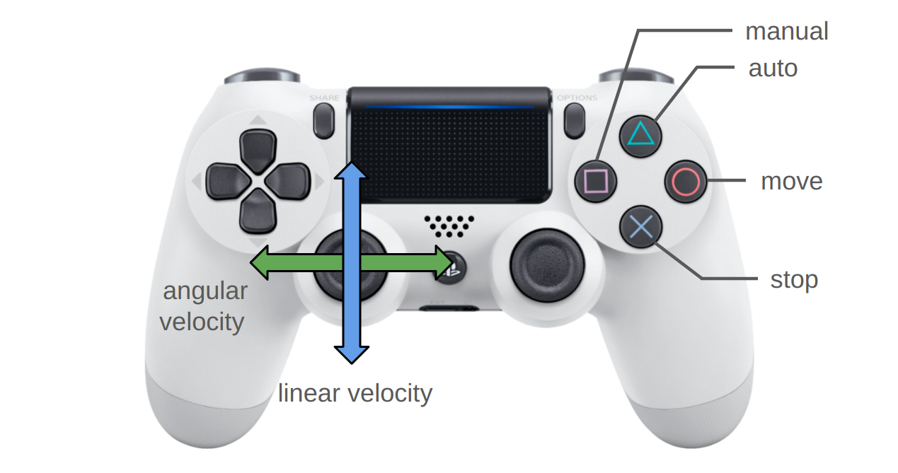

# base_controller_ros

ROS implementation of base controller for mobile robot

<p align="center">
  
</p>

# run demo

```
roslaunch base_controller_ros test.launch

```

## Node I/O


## Nodes

### base_controller

#### Published Topics

- /cmd_vel (`geometry_msgs/Twist`)
  - The velocity command to robot

#### Subscribed Topics

- /joy (`sensor_msgs/Joy`)
  - The joystick input
- /planner/cmd_vel (`geometry_msgs/Twist`)
  - The velocity command from planner

#### Parameters

- ~\<name>/<b>hz</b> (int, default: `20` [Hz]):<br>
  The rate of main loop
- ~\<name>/<b>max_linear_vel</b> (double, default: `0.25` [m/s]):<br>
  The maximum linear velocity
- ~\<name>/<b>max_angular_vel</b> (double, default: `1.0` [rad/s]):<br>
  The maximum angular velocity

## References

- https://github.com/amslabtech/motion_decision

```

```
