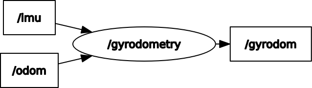

# gyrodometry_ros


ROS implementation of Gyrodometry for 2D navigation

## Environment

- Ubuntu 20.04
- ROS Noetic

## Install and Build

```
# clone repository
cd /path/to/your/catkin_ws/src
git clone https://github.com/phatcvo/gyrodometry_ros.git

# build
cd /path/to/your/catkin_ws
rosdep install -riy --from-paths src --rosdistro noetic # Install dependencies
catkin build gyrodometry_ros -DCMAKE_BUILD_TYPE=Release # Release build is recommended
```

## How to use

```
rosrun gyrodometry_ros gyrodometry_node
```

## Node I/O



## Nodes

### gyrodometry

#### Published Topics

- /gyrodom (`nav_msgs/Odometry`)
  - The gyrodometry data
- /tf (`tf2_msgs/TFMessage`)
  - tf (from the odom frame to the gyrodom frame)

#### Subscribed Topics

- /imu (`sensor_msgs/Imu`)
  - The imu data
- /odom (`nav_msgs/Odometry`)
  - The odometry data

#### Parameters

- ~\<name>/<b>child_frame_id</b> (string, default: `gyrodom`):<br>
  The child frame id of the gyrodometry data

## References

- https://lilaboc.work/archives/18464338.html
- https://github.com/amslabtech/complement
