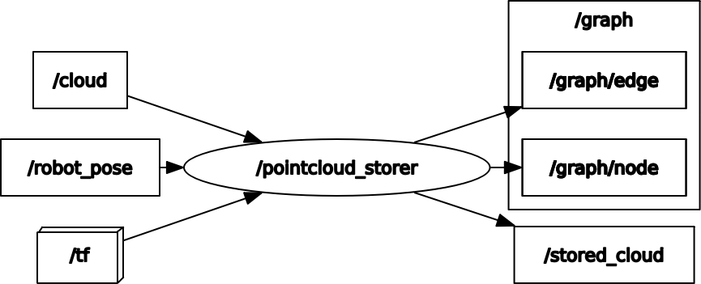

# pointcloud_storer_ros

ROS package for storing pointclouds and poses

The demo assumes that a portion of the scan data has been acquired, so the scan data is extracted with the `pointcloud_angle_filter` node in `amr_navigation_utils_ros` package

## Dependencies

- run with `icp_matching_ros` package

## How to use

```
roslaunch pointcloud_storer_ros pointcloud_storer.launch
```

## Running the demo

# run demo

## terminal 1

export TURTLEBOT3_MODEL=burger
roslaunch pointcloud_storer_ros test.launch

## terminal 2

export TURTLEBOT3_MODEL=burger
roslaunch turtlebot3_teleop turtlebot3_teleop_key.launch

```

## Node I/O



### Runtime requirement

TF (from the frame_id of cloud to the frame_id of robot_pose) is required

## Nodes

### pointcloud_storer

#### Published Topics

- ~\<name>/graph/edge (`nav_msgs/Path`)
  - Edge of pose graph
- ~\<name>/graph/node (`geometry_msgs/PoseArray`)
  - Node of pose graph
- ~\<name>/stored_cloud (`sensor_msgs/PointCloud2`)
  - Stored pointcloud

#### Subscribed Topics

- /cloud (`sensor_msgs/PointCloud2`)
  - Input pointcloud
- /robot_pose (`geometry_msgs/PoseWithCovarianceStamped`)
  - Robot pose

#### Parameters

- ~\<name>/<b>store_num</b> (int, default: `3`):<br>
  The number of pointclouds to store
- ~\<name>/<b>interval</b> (float, default: `0.5` [m]):<br>
  The interval between stored pointclouds
- ~\<name>/<b>leaf_size</b> (float, default: `0.05` [m]):<br>
  The leaf size of voxel grid filter
```
