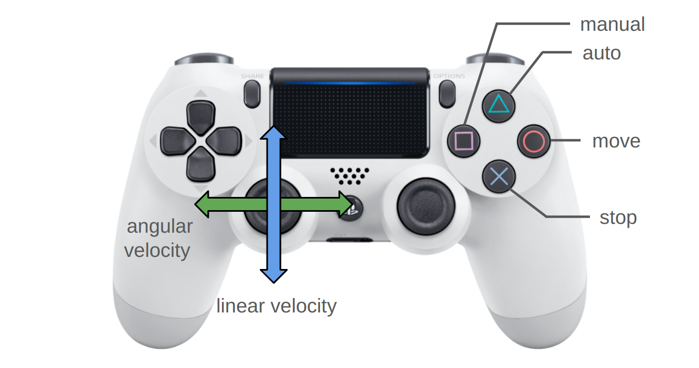
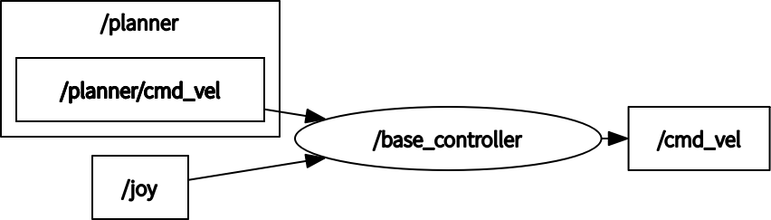

# base_controller_ros


ROS implementation of base controller for mobile robot

<p align="center">
  
</p>

## Environment

- Ubuntu 20.04
- ROS Noetic

## Install and Build

```
# clone repository
cd /path/to/your/catkin_ws/src
git clone https://github.com/phatcvo/base_controller_ros.git

# build
cd /path/to/your/catkin_ws
rosdep install -riy --from-paths src --rosdistro noetic     # Install dependencies
catkin build base_controller_ros -DCMAKE_BUILD_TYPE=Release # Release build is recommended
```

## How to use

```
roslaunch base_controller_ros base_controller.launch
```

## Running the demo

```
# clone repository
cd /path/to/your/catkin_ws/src
git clone -b noetic-devel https://github.com/ROBOTIS-GIT/turtlebot3_msgs.git
git clone -b noetic-devel https://github.com/ROBOTIS-GIT/turtlebot3.git
git clone -b noetic-devel https://github.com/ROBOTIS-GIT/turtlebot3_simulations.git

# build
cd /path/to/your/catkin_ws
rosdep install -riy --from-paths src --rosdistro noetic
catkin build -DCMAKE_BUILD_TYPE=Release

# run demo
export TURTLEBOT3_MODEL=burger
roslaunch base_controller_ros test.launch
```

## Node I/O



## Nodes

### base_controller

#### Published Topics

- /cmd_vel (`geometry_msgs/Twist`)
  - The velocity command to robot

#### Subscribed Topics

- /joy (`sensor_msgs/Joy`)
  - The joystick input
- /planner/cmd_vel (`geometry_msgs/Twist`)
  - The velocity command from planner

#### Parameters

- ~\<name>/<b>hz</b> (int, default: `20` [Hz]):<br>
  The rate of main loop
- ~\<name>/<b>max_linear_vel</b> (double, default: `0.25` [m/s]):<br>
  The maximum linear velocity
- ~\<name>/<b>max_angular_vel</b> (double, default: `1.0` [rad/s]):<br>
  The maximum angular velocity

## References

- https://github.com/amslabtech/motion_decision
