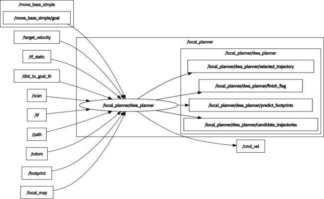

# dwa_planner

## Overview

ROS implementation of DWA(Dynamic Window Approach) Planner

The API documentation is available at [https://amslabtech.github.io/dwa_planner/](https://amslabtech.github.io/dwa_planner/)

**Note: This simulator is not provided.**


## How to use

```
roslaunch dwa_planner local_planner.launch
```

## Running the demo

```
roslaunch dwa_planner demo.launch
```


## Node I/O



### Published/Subscribed Topics

Access [here](docs/Topics.md)

### Runtime requirement

- TF (from GLOBAL_FRAME to ROBOT_FRAME) is required

## Parameters

Access [here](docs/Parameters.md)

## References

- [D. Fox, W. Burgard, and S.Thrun, "The dynamic window approach to collision avoidance", IEEE Robotics Automation Magazine, 1997.](https://ieeexplore.ieee.org/abstract/document/580977)
