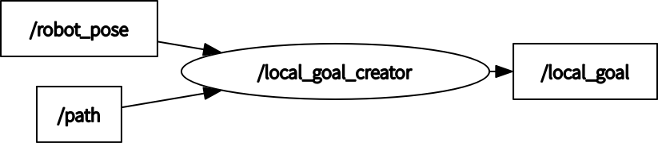

# local_goal_creator_ros

ROS implementation of local goal creator

## How to use

```
roslaunch local_goal_creator_ros local_goal_creator.launch
```

## Running the demo

```
# run demo
roslaunch local_goal_creator_ros test.launch
```

<p align="center">
  
</p>

## Node I/O



## Nodes

### local_goal_creator

#### Published Topics

- ~\<name>/local_goal (`geometry_msgs/PoseStamped`)
  - The local goal

#### Subscribed Topics

- /path (`nav_msgs/Path`)
  - The path to goal
- /robot_pose (`geometry_msgs/PoseWithCovarianceStamped`)
  - The robot pose

#### Parameters

- ~\<name>/<b>hz</b> (int, default: `10` [Hz]):<br>
  The rate of main loop
- ~\<name>/<b>target_dist_to_goal</b> (double, default: `0.5` [m]):<br>
  The distance from the robot to the goal
- ~\<name>/<b>use_direction_in_path</b> (bool, default: `False`):<br>
  Use the pose orientation included in the path
