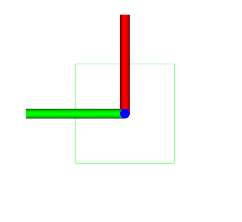
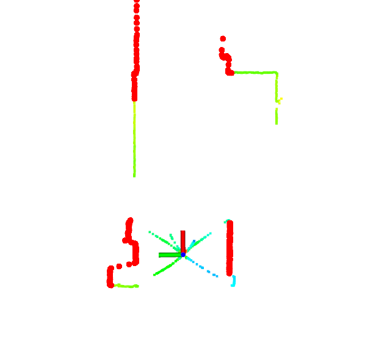

# amr_navigation_utils_ros


Provide a library `amr_navigation_utils_ros` and utility nodes for AMR navigation in ROS

## Environment

- Ubuntu 20.04
- ROS Noetic

## Install and Build

```
# clone repository
cd /path/to/your/catkin_ws/src
git clone https://github.com/phatcvo/amr_navigation_utils_ros.git

# build
cd /path/to/your/catkin_ws
rosdep install -riy --from-paths src --rosdistro noetic          # Install dependencies
catkin build amr_navigation_utils_ros -DCMAKE_BUILD_TYPE=Release # Release build is recommended
```

## How to use

```
# footprint_publisher
rosrun amr_navigation_utils_ros footprint_publisher_node

# pointcloud_angle_filter
roslaunch amr_navigation_utils_ros pointcloud_angle_filter.launch
```

## Running the demo

```
# pointcloud_angle_filter
roslaunch amr_navigation_utils_ros test_pointcloud_angle_filter.launch
```

## Nodes

### footprint_publisher

<p align="center">
  
</p>

#### Published Topics

- ~\<name>/footprint (`geometry_msgs::PolygonStamped`)
  - Footprint

#### Parameters

- ~\<name>/<b>frame_id</b> (string, default: `base_footprint`):<br>
  The frame id of the footprint
- ~\<name>/<b>front_side_length</b> (float, default: `0.5` [m]):<br>
  The length of the front side of the footprint
- ~\<name>/<b>rear_side_length</b> (float, default: `0.5` [m]):<br>
  The length of the rear side of the footprint
- ~\<name>/<b>left_side_length</b> (float, default: `0.5` [m]):<br>
  The length of the left side of the footprint
- ~\<name>/<b>right_side_length</b> (float, default: `0.5` [m]):<br>
  The length of the right side of the footprint

### pointcloud_angle_filter

<p align="center">
  
</p>

#### Published Topics

- ~\<name>/cloud_filtered (`sensor_msgs/PointCloud2`)
  - Filtered pointcloud

#### Subscribed Topics

- /cloud (`sensor_msgs/PointCloud2`)
  - Input pointcloud

#### Parameters

- ~\<name>/<b>valid_angle_range_list</b> (std::vector\<float>, default: `pi/2, pi/2`):<br>
  The list of valid angle range in radian. Refer to `launch/pointcloud_angle_filter.yaml` for example.
