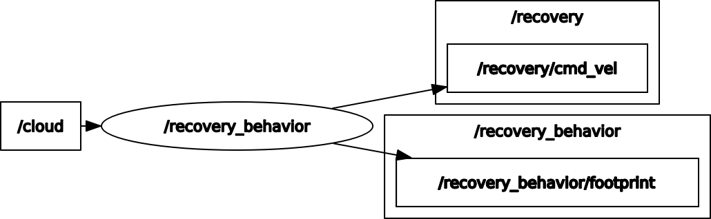

# recovery_behavior_ros

The ROS package for recovery behavior of mobile robots

<p align="center">
  
</p>

## How to use

```
roslaunch recovery_behavior_ros recovery_behavior.launch
```

## Running the demo

```
# run demo
## terminal 1
export TURTLEBOT3_MODEL=burger
roslaunch recovery_behavior_ros test.launch
## terminal 2
rosservice call /recovery_behavior/trigger "{}"
```

## Node I/O



## Nodes

### recovery_behavior

#### Published Topics

- /recovery/cmd_vel (`geometry_msgs/Twist`)
  - Command velocity of recovery mode
- ~\<name>/footprint (`geometry_msgs/PolygonStamped`)
  - Footprint of the robot

#### Subscribed Topics

- /cloud (`sensor_msgs/PointCloud2`)
  - Input pointcloud

#### Service Topics

- ~\<name>/trigger
  - Trigger of recovery behavior

#### Parameters

- Recovery behavior
  - ~\<name>/<b>hz</b> (int, default: `10`):<br>
    The rate of cmd_vel publishing
  - ~\<name>/<b>sim_time_samples</b> (int, default: `10`):<br>
    The number of samples to use when simulating trajectories
  - ~\<name>/<b>vel_samples</b> (int, default: `3`):<br>
    The number of samples to use when searching for the best linear and rotational velocities
  - ~\<name>/<b>move_time</b> (float, default: `2.0` [s]):<br>
    The amount of time to backward simulate trajectories in the future
  - ~\<name>/<b>min_vel_x</b> (float, default: `-0.2` [m/s]):<br>
    The minimum x velocity of the robot
  - ~\<name>/<b>max_vel_theta</b> (float, default: `0.4` [rad/s]):<br>
    The maximum rotational velocity of the robot
- [Footprint](https://github.com/phatcvo/amr_navigation_utils_ros#parameters)
