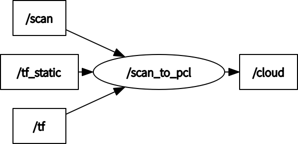

# scan_to_pcl_ros

ROS package for converting scan to pcl

## Dependency

- [laser_geometry](http://wiki.ros.org/laser_geometry)

## How to use

```
roslaunch scan_to_pcl_ros scan_to_pcl.launch
```

## Running the demo

```
roslaunch scan_to_pcl_ros test.launch
```

## Node I/O



### Runtime requirement

TF (from the frame_id of scan to the frame_id of pointcloud) is required

## Nodes

### scan_to_pcl

#### Published Topics

- /cloud (`sensor_msgs/PointCloud2`)
  - The converted pointcloud

#### Subscribed Topics

- /scan (`sensor_msgs/LaserScan`)
  - The input scan data

#### Parameters

- ~\<name>/<b>frame_id</b> (string, default: `base_scan`):<br>
  The frame id of converted pointcloud

## References

- https://github.com/ros-perception/pointcloud_to_laserscan
